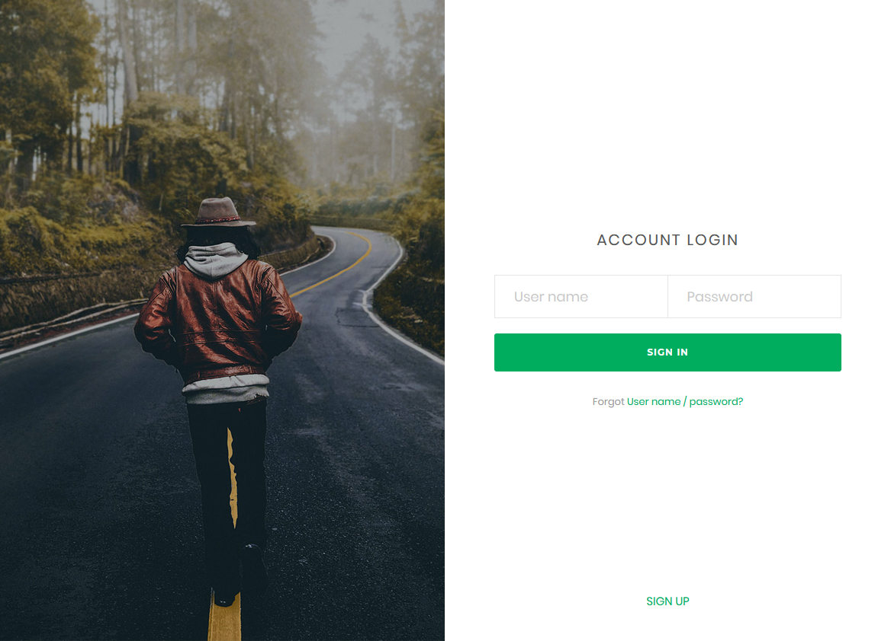
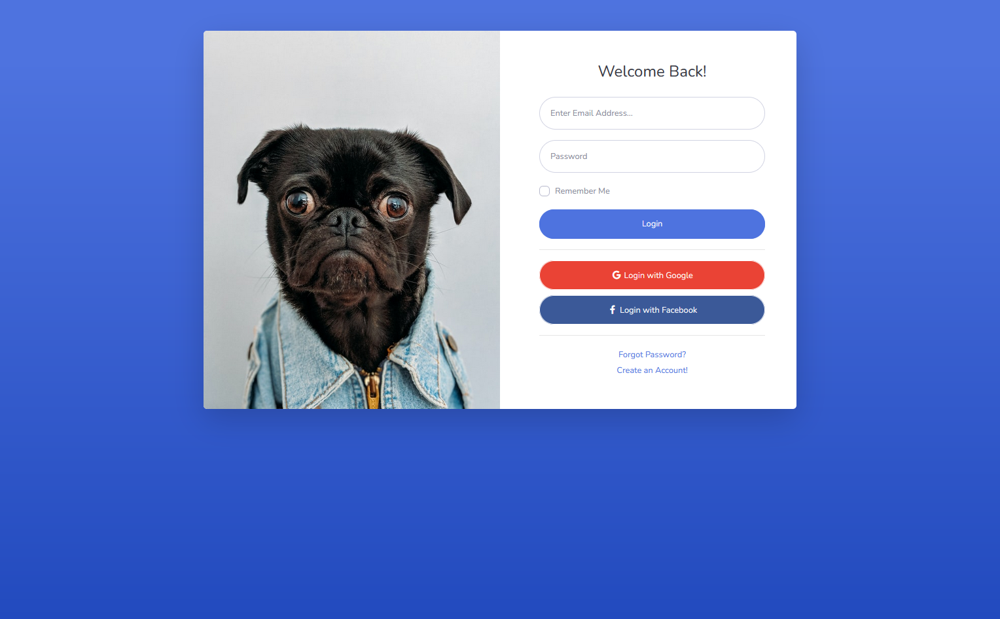
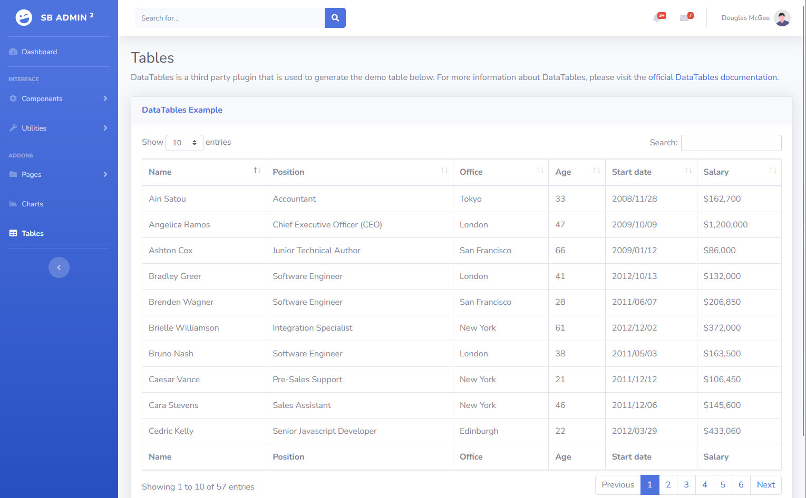

# Get Started

## Install and Configure Github Desktop
- Open your browser and navigate to: https://desktop.github.com/ 
- Download and install Github Desktop
- Open Github Desktop
- Click File => Options => Accounts 
- Click on "Sign in" => Continue with browser
- Sign in to Github in your browser
- When successfully logged in, Github Desktop will now be connected to your github account
- In Github Desktop, click on "File" => "Clone Repository"
- Search and find the project called "tonyawad88/practice-project" and click on "Clone" (Select your local folder where you want the project downloaded)
- This will download the code repository to your local computer


## Install and Configure Backend (Node.js)
- Work in progress
    - Login
    - Get Inventory

## Install and Configure Mini Database (MYSQL or MongoDB)
- Work in progress
    - Users Table
    - Inventory

## Front-end Design
### Login Page:

or

### Dashboard:
- Retrieve list of items from backend




# Project Structure
```
.
├── assets                  # contains images used for documentation
├── frontend                # HTML, CSS, JS
├── backend                 # webserver/REST API and Database
│   ├── webserver           # Node.js 
│   ├── database            # Database (MYSQL or MongoDB) 
```