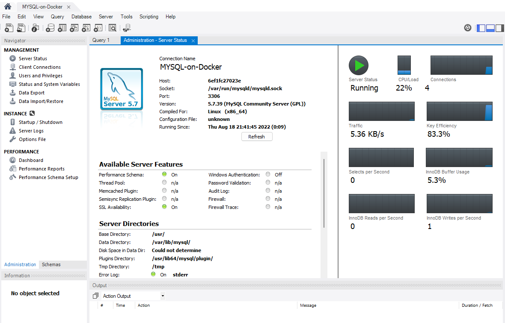
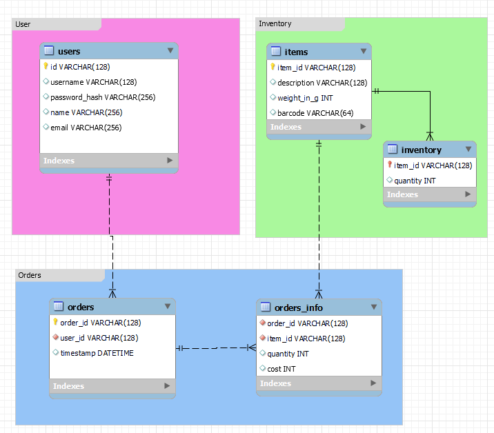
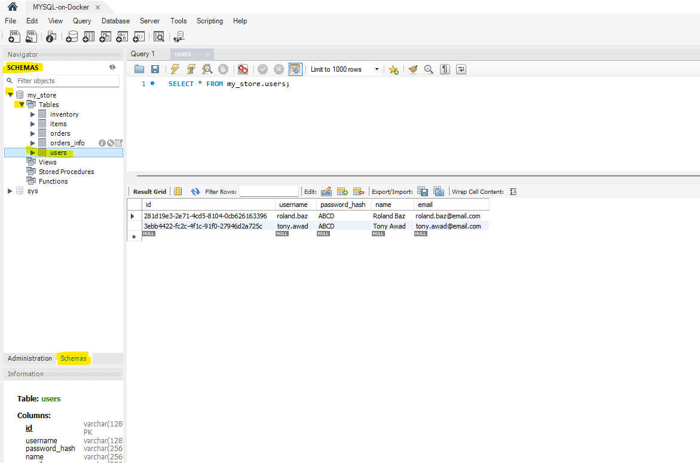
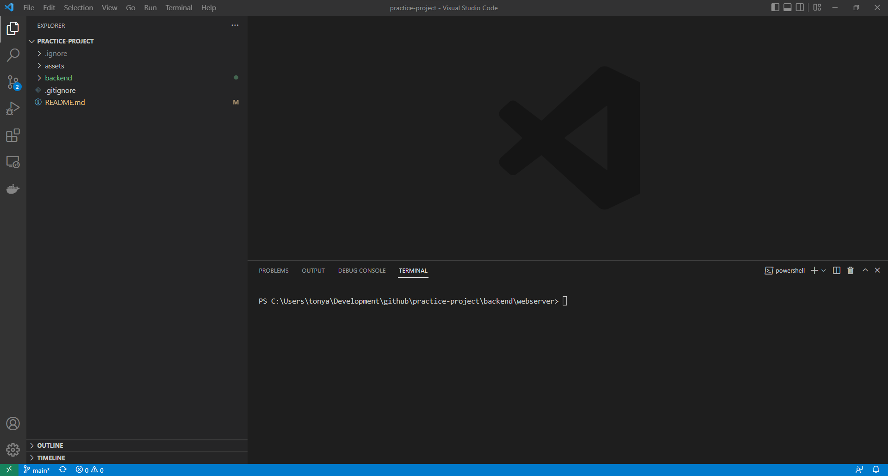

# Project Structure
```
.
├── assets                  # contains images used for documentation
├── frontend                # HTML, CSS, JS
├── backend                 # webserver/REST API and Database
│   ├── webserver           # Node.js 
│   ├── database            # Database (MYSQL or MongoDB) 
```

# Getting Started

## Install and Configure Github Desktop
- Open your browser and navigate to: https://desktop.github.com/ 
- Download and install Github Desktop
- Open Github Desktop
- Click File => Options => Accounts 
- Click on "Sign in" => Continue with browser
- Sign in to Github in your browser
- When successfully logged in, Github Desktop will now be connected to your github account
- In Github Desktop, click on "File" => "Clone Repository"
- Search and find the project called "tonyawad88/practice-project" and click on "Clone" (Select your local folder where you want the project downloaded)
- This will download the code repository to your local computer

## Install and Configure Docker
Docker is a tool that helps you containerize your backend (database and/or webserver). Think of it as you put an object in a container and close the container. Whatever happens outside of that container doesn't affect it. E.g. if you run Node.js version 14 inside that container, and someone comes and installs Node.js 16 on your server/computer, it doesn't affect your app that is running in a container.
For this one we will use it to simplify setting up the database server.
- Open your browser and navigate to: https://docs.docker.com/desktop/install/windows-install/
- Click on "Docker Desktop for Windows" to download it
- When the download is complete, launch the installer to install Docker
- Once the installation is complete, launch Docker
    - Wait until Docker boots up
- Once it's booted, open your command prompt and type in these commands to test the installation:
    - `docker version` (it should return back some docker information)
    - `docker-compose version` (it should return back some docker-compose info and its version)
    - if it doesn't work, reboot and try again
- In command prompt, navigate to the "Practice-Project" directory you cloned using Github Desktop:
    - `cd C:\....\practice-project\backend\database`
    - `docker-compose up -d` (this will download the containerized version of mysql and start it for you)
- In the next steps we are going to connect to it and test it.

## Download MYSQL Workbench and Install it
- Open your browser and navigate to: https://dev.mysql.com/downloads/workbench/
- Click on "Download" to download the installer 
- On the next page click on "No thanks, just start my download."
- Once download, start the installer to install the MYSQL workbench
    - The workbench is used to help you design your database, connect to your server and deploy the database
- Once the installation is complete, launch "MYSQL Workbench" and move to the next section to test the connection to the server we launched using docker above.

## Testing Connection to the MYSQL database server
- Launch MYSQL Workbench
- In the top bar, look for "Database" => "Manage Connections"
- Click on "New"
- Type in a "Connection Name" => `MYSQL-on-Docker`
- Ensure the following settings are set:
    - Hostname: `127.0.0.1`
    - Port: `3306`
    - Username: `root`
- Now click "Test Connection"
- Enter the password: `MyRootPassword`
    - Add the checkmark next to "Save password in vault"
- Click "Ok"
- You should now see "Successfully made the MySQL connection"
- Click on "Close"
- Now in the middle of the MYSQL Workbench window you should see "Rescan servers", click on it
    - It should now show the connection we added above "MYSQL-on-Docker"
    - Double click on it (re-enter password if it asks you)
    - You should now be connected to the server
    - Click on "Server Status" to see a similar screen to the one below.


## Explore MYSQL Workbench Schema
- Launch MYSQL Workbench
- In the top bar, click on "Edit" => "Preferences"
- Look for "Modeling" and click on it
- Put a checkmark next to "Force use of software based rendering..."
- Under "Modeling" as well, select "MYSQL"
- Set the "Default Target MySQL version to: `5.7.39`
- Click "OK"
- Now click on "File" => "Open Model" and navigate to "C:\...\practice-project\backend\database\MYSQL-DB-Model.mwb"
- You should see 5 tables, click on "EER Diagram" to explore the below diagram.
    - The system we will be building is for a mini market. We have users that sign in and order groceries.
 

## Deploy Database Schema to MYSQL Server
- Make sure you have the model file opened
    -  "File" => "Open Model" and navigate to "C:\...\practice-project\backend\database\MYSQL-DB-Model.mwb"
- In the top bar, click on "Database" => "Forward Engineer"
- Select the connection we created "MYSQL-on-Docker"
- Click Next
- Look for "Generate INSERT statements for tables" and put a checkmark next to it
- Look for "DROP objects before each CREATE object" and put a checkmark next to it
- Look for "Include model attached scripts" and put a chekcmark next to it
- Click Next => Next => Next
- Verify that "Forward Engineer Finished Successfully"
- Click "Close"
- Now the model / schema of the database is deployed to the server

## Connect to Server and explore database:
- Launch MYSQL Workbench
- Double click on "MYSQL-on-Docker" connection to connect to database server
- On the left hand side, select "Schemas" so you can see "my_store" datbase
- Expand "my_store" => "Tables" and you should see all the tables (inventory, items, etc)
- Right click on "users" table and click on "Select Rows - Limit 1000"
- Database is pre-populated with some records
 


## Install and Configure Backend (Node.js)
- Open your browser and navigate to https://nodejs.org/en/
- Download NodeJS for Windows - Choose LTS version
    - Current version is 16.17.0 LTS but it may vary when you download it
    - Just make sure you are download the LTS version
- Double click and launch the NodeJS Installer
    - Click Next (first page of the installer) => Accept the agreement => Next (Destination Folder)
    - (Custom Setup page) - Make sure "Add to PATH" has both Node.js and npm & npm modules
    - Next => ... => Install 
    - Finish

## Install Postman
- Open your browser and navigate to https://www.postman.com/downloads/
- Click on "Windows xx bit" to download
- Once downloaded launch the installer and install Postman

## Install VSCode
- Open your browser and navigate to https://code.visualstudio.com/
- Click on "Download for Windows" to download it

## Install npm modules and launch Node.js Backend
- Open Github Desktop and make sure you get the latest version of the github project
    - You can do so by clicking "Repository" => "Pull" or by clicking on "Fetch origin"
- Now that you have the latest version of the code, open Visual Studio Code
- Click File => Open Folder => Navigate to the project folder and click "Select Folder", you should see something similar to this:

- Note the folders and files on the left hand side (assets, backend, .gitignore, README.md). Make sure these folders and files are at the root of your project, if not repeat the previous step and double click on "practice-project" folder, then click on "Select Folder"
- Now open the terminal window in VSCode, you can do so by clicking on "Terminal" => "New Terminal" on the top bar
- Once opened, type in `ls` and the folders and files that appear should be the same files and folders mentioned in the Note above (assets, backend, .gitignore, README.md)
- Navigate to the backend code by typing in: `cd backend\webserver\`
- Install node modules by typing in `npm install`
- Once the install completes, run the webserve using `node app.js` (make sure you have 'cd' into the directory that contains app.js)
    - The output from the above step should be: `Webserver listening on port 3000`
    - To test it out, open your browser and type in: `http://localhost:3000` the output should be "Hello from NodeJS Webserver!"

## Launch Postman
- Launch Postman which is the software we downloaded previously (This will help you simulate HTTP requests to your webserver)
- Once you launch it, if asked to sign in, just select continue offline.
- Press on the keyboard `Ctrl + O` (O like Oscar) or click on the top left of the window =>  File => Import
- On the "Import" screen, select File => "Upload Files"
- Navigate to "practice-project\backend\webserver\postman" and select "Practice-Project.postman_collection.json", click Open
- Click "Import"
- In the left panel you should see "Practice-Project"
- Expand it and you should see 2 methods: Login and Get Inventory
- Click on "(POST) Login" and click on "Send" (if it crashes, make sure you have launched "Docker Desktop" and your database is up and running)
    - If it crashes, you will need to restart your server using `node app.js` (steps in the previous section)
    - If it succeeds, you should get back a message saying "Login Successful". During the call from Postman to your webserver, Postman sent the webserver a POST request with a method / action "login". It also sent it the username: "roland.baz" and a password: "ABCD". The webserver when it received the request made a call to the database to check if theu username and password are valid and if so, it returned a message with a token. Try changing the username or password to a random value and click "Send" again. To change the username or password, in postman, find the "Body" tab once you have selected the "Login" method and note the username and password.

- Now let's test "Get Inventory", click on "Get Inventory" and click on "Send"
    - Note, the method has changed, it is now a "GET" and the method name is called "inventory"
    - Navigate to the "Body" in "Get Inventory" and note the "token" we are sending. Try changing the token and click "Send" again to see what happens.
- Final step, take a look at the backend code and what is it doing and try to follow along it should be straightforward
    - In particular, inspect `app.js`, `inventory.js` and `login.js`
- Now that we have proven the backend is working, the final stepw would be to create the frontend which we can work on together.

## Front-end Design
### Login Page:

or

### Dashboard:
- Retrieve list of items from backend


